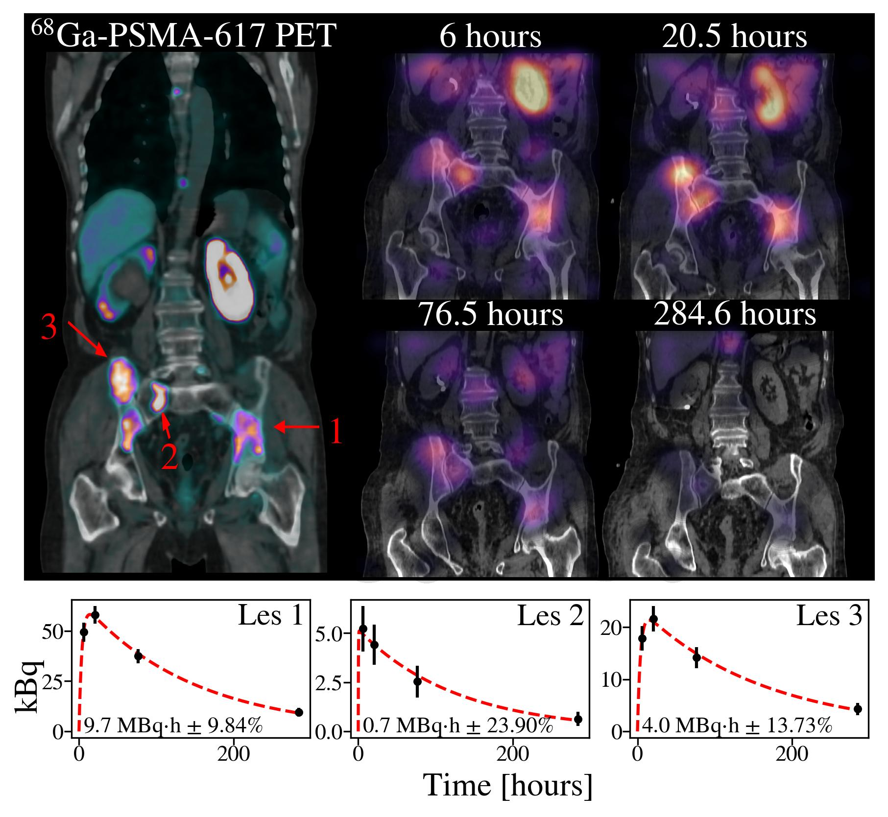
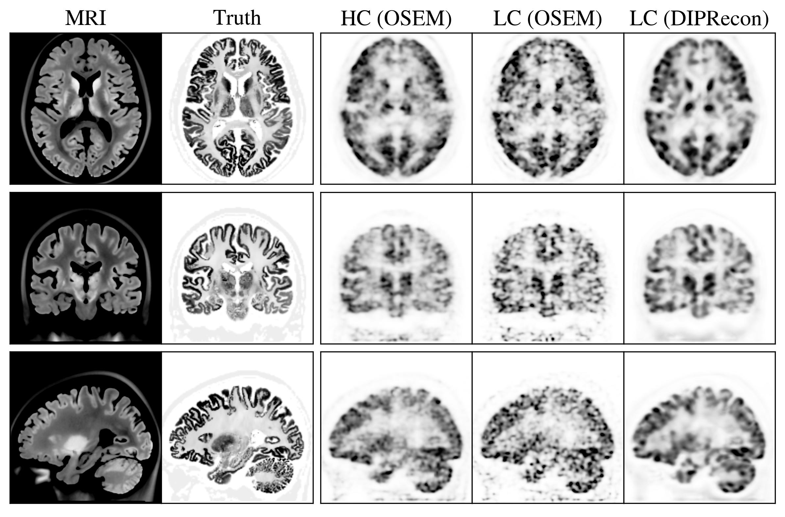
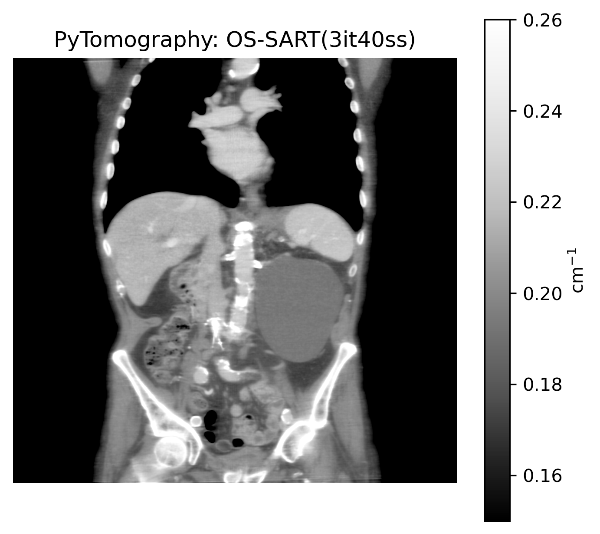

.. _gallery-index:

====================
Gallery
====================

.. note::
     Let us know on `Discourse <https://pytomography.discourse.group/>`_ if you have any images you would like to share! We'll happily give a shout out to any associated papers in the caption.

++++++++++++++++++++
Figure 1: Lu-177 SPECT
++++++++++++++++++++

This data corresponds to a patient receiving Lu-177-PSMA-617 treatment. The images were reconstructed using the MIM (left) and PyTomography with four available reconstruction algorithms. The noise in the liver, as well as the total counts in selected ROIs are shown. The bottom images show axial slices of the region given by the blue arrow, indicative of bone metastasis in the sternum.

.. image:: images/figure2.jpg
  :width: 800
  :alt: Alternative text

++++++++++++++++++++
Figure 2: Ac-225 SPECT
++++++++++++++++++++

*Left image not reconstructed with PyTomography*. The data here corresponds to a patient receiving Ac-225-PSMA-617 treatment; an associated PET scan is shown on the left. The right shows SPECT reconstruction at four different time points after initial injection. The Ac-225 data was reconstructed using advanced PSF modeling capabilities of the `SPECPSFToolbox <https://spectpsftoolbox.readthedocs.io/en/latest/>`_. Bottom plots show time activity curves in the three lesion ROIs specified on the PET image; uncertainties were obtained using the uncertainty estimation capabilities of PyTomography.

++++++++++++++++++++
Figure 3: PET with Deep Image Prior
++++++++++++++++++++

Reconstruction of GATE Monte Carlo PET data of a brain phantom using PyTomography. Shown are the ground truth PET/MR images, as well as a high count reconstruction with OSEM, a low count reconstruction with OSEM, and a low count reconstruction with the Deep Image Prior reconstruction algorithm. PyTomography was used for the entire process: list mode, time of flight (TOF) reconstruction, including random and TOF scatter estimation, as well as the development and integration of the neural network.

++++++++++++++++++++
Figure 4: Clinical CT Reconstruction
++++++++++++++++++++

Reconstruction of clinical CT data (in DICOM-CT-PD format) from a 3rd generation system. Yhe data was reconstructed using OS-SART for 3 iterations with 40 subsets. 

