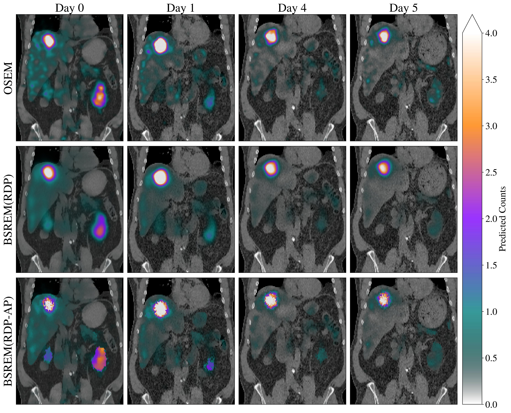

% PyTomography documentation master file, created by
% sphinx-quickstart on Fri Feb  3 20:09:10 2023.
% You can adapt this file completely to your liking, but it should at least
% contain the root `toctree` directive.


# PyTomography
PyTomography is a python library for medical image reconstruction. It uses the functionality of PyTorch to (i) enable fast GPU-accelerated reconstruction and (ii) permit easy integration of deep-learning models in traditional reconstruction algorithms. **If you use PyTomography in your own research, please cite the following:** [https://arxiv.org/abs/2309.01977](https://arxiv.org/abs/2309.01977)

## Features
**Supported Modalities**
* Single Photon Computed Emission Tomography (SPECT)
    - System matrix modeling includes attenuation correction, PSF modeling, scatter correction
* Positron Emission Tomography (PET) 
    - Listmode
    - Time-of-flight
    - Corrections for attenuation/normalization, and options for PSF modeling.

**Reconstruction Algorithms**
* Filtered Back Projection (FBP)
* Statistical Iterative Algorithms
    - OSEM / MLEM
    - OSEMOSL (see [here](https://ieeexplore.ieee.org/document/52985))
    - BSREM (see [here](https://ieeexplore.ieee.org/document/1207396))
    - KEM (see [here](https://ieeexplore.ieee.org/abstract/document/6868314))
    - DIPRecon (see [here](https://ieeexplore.ieee.org/document/8581448))
    
Options exist to include anatomical information (such as MRI/CT) when using priors/regularization.

**Supported Datatypes**
* DICOM (SPECT)
    - Ability to open and align SPECT/CT data and create attenuation maps
    - Repository of collimator parameters for different scanners for obtaining PSF information
* SIMIND output files (SPECT)
    - Functionality to combine multiple sets of projections (representing different organs/regions) into a single set of projection data
* GATE output files (PET)
    - ability to read ROOT files generated from gate simulations
    - generation of scanner lookup tables (detector coordinates) from GATE macro files 
* PETSIRD data files (PET)
    - ability to read PETSIRD files, which contain all detected events and scanner geometry information

## Installation

Firstly, it is important that all your graphics card drivers are up to date. To ensure this, go to [this link](https://www.nvidia.com/Download/index.aspx), enter your graphics card information, and download/install the newest possible driver. It is also recommended that you download anaconda using [this link](https://www.anaconda.com/download) to manage your python environments. 

Firstly, create a pytomography virtual environment using anaconda:
```
conda create --name pytomography_env
```

Then you can activate your environment, and install PyTomography:
```
conda activate pytomography_env
pip install pytomography
```

If you want to use the PET reconstruction options available, you need to additionally follow the installation instructions for parallelproj at [this link](https://parallelproj.readthedocs.io/en/stable/installation.html).

Be sure to check out  {doc}`usage` for some simple examples. If you wish to make a contribution, please read the {doc}`developers_guide`.

## Examples
**Example 1**: *SPECT/CT Images of patient receiving targeted radionuclide therapy with Lu177 DOTATATE for neuroendocrine tumours (4 cycles of 7.4 GBq/cycle administered every 8 weeks). Row 1: OSEM (5 iterations, 8 subsets); row 2: BSREM (30 iterations, 8 subsets) using the RDP prior; row 3: BSREM (30 iterations, 8 subsets) using the RDP prior with anatomical weighting.*



**Example 2**: *Ultra high resolution PET/MR brain phantom ground truth and reconstructions with time-of-flight. PET Monte Carlo acquisition data was obtained via simulation of a Siemens mMR scanner (with 550 ps time-of-flight resolution) in GATE. From top to bottom: sample axial, coronal, and sagittal slices. From left to right: T1-weighted MR image (inverse contrast), ground truth PET concentration, high count (630 million events) reconstruction with OSEM (4it20ss), low count recon (35 million events) with OSEM (80it/1ss) and low count recon (35 million events) with the DIPRecon method (100it).*
*


## Contents

```{toctree}
:maxdepth: 1

usage
developers_guide
external_data
```

