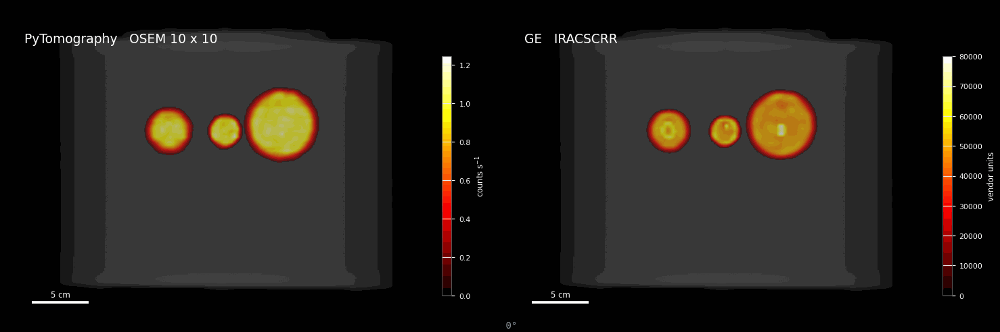

# PyTomography

<div class="pt-landing">

<section class="pt-hero">
  <div class="pt-hero-text">
    <p class="pt-eyebrow">Open source · GPU accelerated · 4.0 preview</p>
    <p class="pt-h1">Quantitative SPECT, PET and CT reconstruction</p>
    <p class="pt-lede">Read projections straight from vendor DICOM, SIMIND or GATE. Model attenuation, scatter and the full collimator response. Reconstruct on the GPU with OSEM, BSREM, KEM, or a network you design yourself.</p>
    <div class="pt-cta">
      <a class="pt-btn pt-btn-primary" href="tutorials/index.html">Start with a tutorial</a>
      <a class="pt-btn" href="gallery.html">See the gallery</a>
    </div>
    <div class="pt-install"><span class="pt-prompt">$</span><code>pip install pytomography</code><button type="button" class="pt-copy" data-copy="pip install pytomography">Copy</button></div>
  </div>
  <figure class="pt-hero-fig">
    
    <figcaption><span>Tc-99m NEMA IQ phantom · GE StarGuide, 12 CZT heads</span><span>OSEM 10×10 with attenuation, scatter and PSF</span></figcaption>
  </figure>
</section>

<section class="pt-modalities" aria-label="Supported modalities">
  <div><b>SPECT</b><span>DICOM from GE, Siemens and StarGuide, and SIMIND. Multiple beds and photopeaks, cardiac reorientation, hybrid Monte Carlo scatter.</span></div>
  <div><b>PET</b><span>GATE sinograms and list mode, time of flight, GE Discovery MI and PETSIRD. Randoms and single scatter simulation.</span></div>
  <div><b>CT</b><span>DICOM-CT-PD projections from 3rd-generation clinical scanners, reconstructed with OS-SART.</span></div>
  <div><b>Your own system</b><span>Every system matrix is a forward and back projector you can replace, so new geometries, priors and networks reuse every algorithm.</span></div>
</section>

<section class="pt-split">
<div class="pt-split-text">
  <p class="pt-eyebrow">How it works</p>
  <h2 class="pt-h2">Every reconstruction is three steps</h2>
  <p>Read the data, describe the physics, then choose a likelihood and an algorithm. Each step is its own object, so you can swap one without touching the others.</p>
  <dl class="pt-steps">
    <dt>1 · Data</dt><dd>Projections, energy windows and geometry, read from the file the scanner wrote.</dd>
    <dt>2 · Physics</dt><dd>Attenuation from the CT and the collimator-detector response, applied inside the projector.</dd>
    <dt>3 · Statistics</dt><dd>A Poisson likelihood with scatter as an additive term, solved by the algorithm of your choice.</dd>
  </dl>
</div>
<div class="pt-split-code">

```python
from pytomography.io.SPECT import dicom
from pytomography.transforms.SPECT import SPECTAttenuationTransform, SPECTPSFTransform
from pytomography.projectors.SPECT import SPECTSystemMatrix
from pytomography.likelihoods import PoissonLogLikelihood
from pytomography.algorithms import OSEM

# 1. Data: Lu-177 SPECT/CT exported from the scanner
object_meta, proj_meta = dicom.get_metadata(file_NM, index_peak=0)
photopeak = dicom.get_projections(file_NM, index_peak=0)
scatter = dicom.get_energy_window_scatter_estimate(file_NM, index_peak=0, index_lower=1, index_upper=2)

# 2. Physics
attenuation = SPECTAttenuationTransform(filepath=files_CT)
psf_meta = dicom.get_psfmeta_from_scanner_params("SY-ME", 208, intrinsic_resolution=0.38)
psf = SPECTPSFTransform(psf_meta)
system_matrix = SPECTSystemMatrix(
    obj2obj_transforms=[attenuation, psf],
    proj2proj_transforms=[],
    object_meta=object_meta,
    proj_meta=proj_meta,
)

# 3. Statistics and algorithm
likelihood = PoissonLogLikelihood(system_matrix, photopeak, scatter)
recon = OSEM(likelihood)(n_iters=4, n_subsets=8)
```

</div>
</section>

<section class="pt-showcase">
  <div class="pt-showcase-head">
    <p class="pt-eyebrow">Gallery</p>
    <h2 class="pt-h2">Used on patients and phantoms</h2>
  </div>
  <div class="pt-shots">
    <a href="gallery.html#figure-1-lu-177-spect"><span><b>Lu-177 PSMA SPECT</b>Four algorithms compared with a commercial reconstruction</span></a>
    <a href="gallery.html#figure-2-ac-225-spect"><span><b>Ac-225 PSMA SPECT</b>Monte Carlo PSF modelling and uncertainty over four time points</span></a>
    <a href="gallery.html#figure-3-pet-with-deep-image-prior"><span><b>PET with Deep Image Prior</b>Low-count TOF list mode with a network as the image model</span></a>
    <a href="gallery.html#figure-4-clinical-ct-reconstruction"><span><b>Clinical CT</b>OS-SART on raw DICOM-CT-PD projections</span></a>
  </div>
</section>

<section class="pt-join">
  <div>
    <p class="pt-eyebrow">Built by its users</p>
    <h2 class="pt-h2">Add the method your research needs</h2>
    <p>PyTomography grows through contributions from the people who use it. The feature board lists work we want done, each item with data to test on, a place in the code to start, and a clear definition of done.</p>
  </div>
  <div class="pt-join-links">
    <a href="contributing/feature-board.html"><b>Feature board</b><span>Pick something to build</span></a>
    <a href="contributing/index.html"><b>Contributing guide</b><span>Set up, test, open a pull request</span></a>
    <a href="ai.html"><b>For AI assistants</b><span>llms.txt and Markdown pages</span></a>
  </div>
</section>

<section class="pt-cite">
<div>
  <p class="pt-eyebrow">Citing PyTomography</p>
  <p>If PyTomography helps your research, please cite the paper in <a href="https://doi.org/10.1016/j.softx.2024.102020">SoftwareX</a>.</p>
</div>
<div class="pt-cite-code">

```bibtex
@article{polson2025pytomography,
  title   = {PyTomography: A python library for medical image reconstruction},
  author  = {Polson, Lucas A. and Fedrigo, Roberto and Li, Chenguang and Sabouri, Maziar and
             Dzikunu, Obed and Ahamed, Shadab and Karakatsanis, Nicolas and Kurkowska, Sara and
             Sheikhzadeh, Peyman and Esquinas, Pedro and Rahmim, Arman and Uribe, Carlos},
  journal = {SoftwareX},
  volume  = {29},
  pages   = {102020},
  year    = {2025},
  doi     = {10.1016/j.softx.2024.102020}
}
```

</div>
</section>

</div>

```{toctree}
:hidden:

install
tutorials/index
gallery
API <api/pytomography/index>
Contribute <contributing/index>
Migrate to v4 <migration>
concepts
For AI agents <ai>
Data tables <external_data>
```
