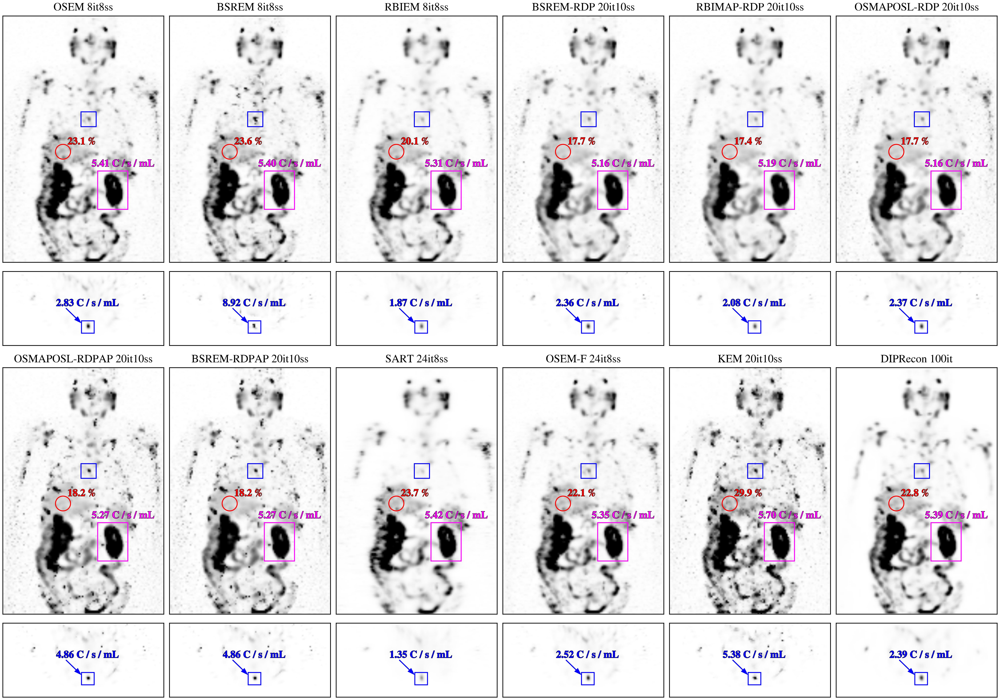
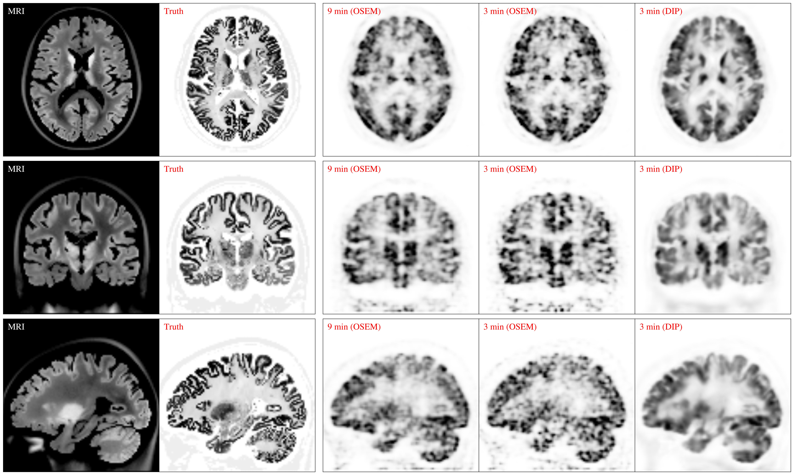

% PyTomography documentation master file, created by
% sphinx-quickstart on Fri Feb  3 20:09:10 2023.
% You can adapt this file completely to your liking, but it should at least
% contain the root `toctree` directive.


# PyTomography
PyTomography is a python library for medical image reconstruction. It uses the functionality of PyTorch to (i) enable fast GPU-accelerated reconstruction and (ii) permit easy integration of deep-learning models in traditional reconstruction algorithms. **If you use PyTomography in your own research, please cite the following:** [https://arxiv.org/abs/2309.01977](https://arxiv.org/abs/2309.01977)

## Features
**Modalities**
* Single Photon Computed Emission Tomography (SPECT)
    - Support for attenuation correction, PSF modeling, and energy window based scatter correction
    - Support for SIMIND and DICOM data, including stitching of multiple bed positions
* Positron Emission Tomography (PET) 
    - Support for sinogram/listmode and time-of-flight reconstruction with attenuation, normalization, random, and scatter correction (time-of-flight based single scatter simulation)
    - Support for GATE, HDF5, and PETSIRD data formats
* Computed Tomography (CT)
    - Support for 3rd generation CT systems and reading of data in the DICOM-CT-PD format.

**Reconstruction Algorithms**
* Statistical Iterative Algorithms
    - Standard clinical algorithms such as OSEM / MLEM
    - Regularized algorithms such as OSMAPOSL (see [here](https://ieeexplore.ieee.org/document/52985)) and BSREM (see [here](https://ieeexplore.ieee.org/document/1207396))
    - AI-based algorithms such as DIPRecon (see [here](https://ieeexplore.ieee.org/document/8581448))

## Installation

Firstly, it is important that all your graphics card drivers are up to date. To ensure this, go to [this link](https://www.nvidia.com/Download/index.aspx), enter your graphics card information, and download/install the newest possible driver. It is also recommended that you download anaconda using [this link](https://www.anaconda.com/download) to manage your python environments. 

Firstly, create a pytomography virtual environment using anaconda; the library requires python 3.11 or higher:
```
conda create --name pytomography_env -c conda-forge python=3.11
```

Then you can activate your environment, and install PyTomography:
```
conda activate pytomography_env
pip install pytomography
```

If you want to use the PET reconstruction options available, you need to additionally follow the installation instructions for parallelproj at [this link](https://parallelproj.readthedocs.io/en/stable/installation.html).

## Tutorials

Be sure to check out  {doc}`usage` for some simple examples. If you wish to make a contribution, please read the {doc}`developers_guide`.

## User Forum

If you have any questions about how to use the software, feel free to ask them on the discourse page at [this link](https://pytomography.discourse.group/).

## Examples
**Example 1**: *Reconstruction of Lu177-PSMA patient data using the available reconstruction algorithms.*



**Example 2**: *Ultra high resolution PET/MR brain phantom reconstructed using list-mode time-of-flight reconstruction with standard OSEM and the AI-Based Deep Image Prior reconstruction algorithm. Scatter estimation (listmode/time-of-flight) was obtained via single scatter simulation (SSS).*



## Contents

```{toctree}
:maxdepth: 1

usage
developers_guide
external_data
```

