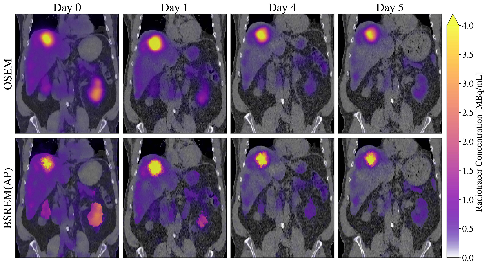

# PyTomography

<p style='text-align: justify;'>
PyTomography is a python library for medical image reconstruction. It uses the functionality of PyTorch to (i) enable fast GPU-accelerated reconstruction and (ii) permit easy integration of deep-learning models in traditional reconstruction algorithms.


* *SPECT/CT Images of patient receiving targeted radionuclide therapy with Lu177 DOTATATE for neuroendocrine tumours (4 cycles of 7.4 GBq/cycle administered every 8 weeks). Columns correspond to images taken X days after injection. Top row corresponds to reconstruction using OSEM (5 iterations, 8 subsets) while bottom row corresponds to use of BSREM (30 iterations, 8 subsets) using the relative difference prior using anatomical information to include only similar neighbours.*

## Supported Modalities
* Single Photon Computed Emission Tomography (SPECT)
    - System matrix modeling includes attenuation correction, PSF modeling, scatter correction
* 2D Positron Emission Tomography (PET)
    - System matrix modeling includes attenuation correction and radially dependent PSF modeling.

## Reconstruction Algorithms
* Maximum Liklihood Expectation Maxmimum (MLEM) and Ordered Subset Expectation Maximum (OSEM)
    - One-Step-Late and Block-Sequential-Regularization techniques to encorporate Bayesian priors
    - Option to include anatomical information (such as MRI/CT) in Bayesian priors

## Supported Datatypes
* DICOM
    - Ability to open and align SPECT/CT data and create attenuation maps
    - Repository of collimator parameters for different scanners for obtaining PSF information
* SIMIND output files (interfile)
    - Functionality to combine multiple sets of projections (representing different organs/regions) into a single set of projection data

## Installation

This library requires a local installation of PyTorch. As such, it is recommended to first create a virtual environment using anaconda:

```
conda create --name pytomography
```

and then install the version of PyTorch you need inside that environment [here](https://pytorch.org/get-started/locally/). Finally, install pytomography using the following command:

```
pip install pytomography
```

